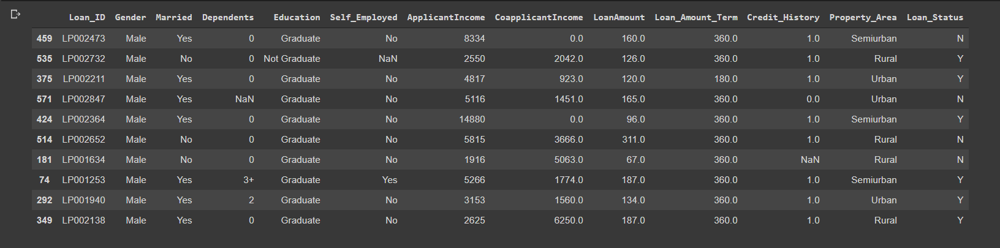
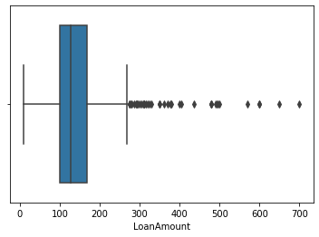

# Loan Approval Prediction Using Flask and Heroku

This repo contains the Loan Approval Prediction project.

Accuracy of the modle i.e. percentage of loan approval that is correctly predicted. After trying and testing 4 different algorithms, the best accuracy is achieved by Logistic Regression (0.7847), followed by RandomForest (0.7778) and XGBoost (0.7778), while Decision Tree performed the worst (0.6458).

This Project Covers following Process:

1. Problem Statement
2. Data Collection
3. Exploratory Data Analysis
4. Data Pre-processing 
5. Model Development and Evaluation
6. Conclusion

## 1. Problem Statement
About Company
Dream Housing Finance company deals in all home loans. They have presence across all urban, semi urban and rural areas. Customer first apply for home loan after that company validates the customer eligibility for loan.

Company wants to automate the loan eligibility process (real time) based on customer detail provided while filling online application form. These details are Gender, Marital Status, Education, Number of Dependents, Income, Loan Amount, Credit History and others. To automate this process, they have given a problem to identify the customers segments, those are eligible for loan amount so that they can specifically target these customers. Here they have provided a partial data set.

## 2. Data Collection
In data collection first I uploaded all the necessary libraries, after that I loded the dataset, And using sample() function from pandas library I observed the dataset.

The View of the dataset

You don't understand lot just by looking into it so we will perform Exploratory data analysis

## 3. Exploratory Data Analysis(EDA)
Now I used info() method so I could understand it better. Afer applying the info() method I got to know that There are thirteen columns, four of them contains Float values, one of it have integer value and eight columns have categoricals values.

Clearly this wan't enough so I used describe() method. It gave me count of the rows, mean, standard deviation, minimum values, maximum values and values for 25%, 50%, 75%.

Now that I had a little bit idea about what data is I started cleaning it,

So first I checked for NUll values and there were few columns who had Null values

Below Images shows that there are lot of outliers and NULL values

