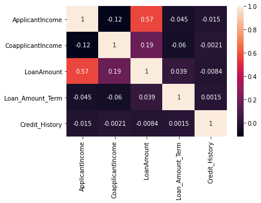

# Loan Approval Prediction Using Flask and Heroku

**This repo contains the Loan Approval Prediction project.**

Accuracy of the modle i.e. percentage of loan approval that is correctly predicted. After trying and testing 8 different algorithms, the best accuracy is achieved by Logistic Regression and SVC (0.8292), followed by ExtraTreesClassifier (0.7317) and RandomForestClassifier (0.6910), while Decision Tree performed the worst (0.6510).

**Link To the web Application: **

https://loanpredictionsapp.herokuapp.com/

This Project Covers following Process:

1. Problem Statement
2. Data Collection
3. Exploratory Data Analysis
4. Data Pre-processing 
5. Model Development and Evaluation
6. Conclusion

## 1. Problem Statement
About Company
Dream Housing Finance company deals in all home loans. They have presence across all urban, semi urban and rural areas. Customer first apply for home loan after that company validates the customer eligibility for loan.

Company wants to automate the loan eligibility process (real time) based on customer detail provided while filling online application form. These details are Gender, Marital Status, Education, Number of Dependents, Income, Loan Amount, Credit History and others. To automate this process, they have given a problem to identify the customers segments, those are eligible for loan amount so that they can specifically target these customers. Here they have provided a partial data set.

## 2. Data Collection
In data collection first I uploaded all the necessary libraries, after that I loded the dataset, And using sample() function from pandas library I observed the dataset.

The View of the dataset

You don't understand lot just by looking into it so we will perform Exploratory data analysis

## 3. Exploratory Data Analysis(EDA)
Now I used info() method so I could understand it better. Afer applying the info() method I got to know that There are thirteen columns, four of them contains Float values, one of it have integer value and eight columns have categoricals values.

Clearly this wan't enough so I used describe() method. It gave me count of the rows, mean, standard deviation, minimum values, maximum values and values for 25%, 50%, 75%.

Now that I had a little bit idea about what data is I started cleaning it,

So first I checked for NUll values and there were few columns who had Null values

Below Images shows that there are lot of outliers and NULL values

Now we will have a look at correlation matrix. Correlation matrix is a tabel showing correlation coefficient between variables.

Pairplot shows the relationship for (n,2) combination of variable in a DataFrame as a matrix of plots

Scatter plot(Relationship plot) gives the better understanding of the dataset. It uses three different values that means we can see the relationship between two variables with repsect to another variable.

a. The first scatter plot shows the relationship between LoanAmount and ApplicantIncome with respect to Self_Employed

b. This plot shows relation with respect to the Applicants Marriage. From this plot we can conclude that there are lot of married Applicant and clearly that's going to affect in our prediction.

c. From this plot we can say that Male applicant are more than Female applicant's.

d. Same for Education plot.

## 4. Data pre-processing
In data processing first of all I selcted few columns which are important for model development. Few of them have a categorical values so I used get_dummies() method from pandas library to convert them into numerical values.

Now I need to select dependent variable so I choosed Loan_Status which have values in Y and N.

Data set had a null values so I used SimpleImputer.

After selecting dependent variable I split the data set into train and test dataset.

## 5. Model Development and Evaluation 
I needed to choose the perfect model which gives me best score. So to do that I used pipeline.

After trying and testing 8 different algorithms, the best accuracy is achieved by Logistic Regression and SVC (0.8292), followed by ExtraTreesClassifier (0.7317) and RandomForestClassifier (0.6910), while Decision Tree performed the worst (0.6510).

SO I used LogisticRegression to train my dataset.

After training and predictions, I downloaded the model using pickle library form python.

## 6. Conclusion
After downloading the model using pickle, it was time to start develop web application, so I chossed Flask.

I created a web page including all the entrylies model need to predict weather the customer is able to get a loan.

After that I needed a colud service on which I can upload my website so I used Heroku.

**Preview**

